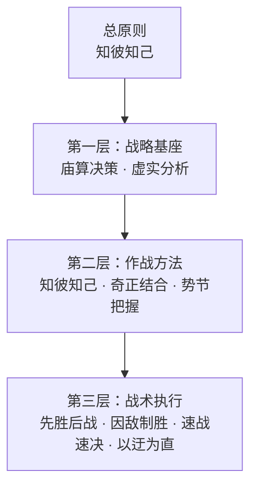

# ⚔️ 孙子 Skill —— 提升 AI 的战略思维

> "知彼知己者，百战不殆。"

> "兵者，国之大事，死生之地，存亡之道，不可不察也。"

---

**你的 AI 不应该只会埋头执行。它应该先看清局势，再选择行动。**

「孙子 Skill」是一个 AI Agent Skills 合集，从《孙子兵法》十三篇中提炼出一条总原则和九大战略方法论，系统性提升 AI 的战略思维能力。不是兵棋推演，不是历史课堂，而是可操作的决策方法论集合。

每一条方法都有据可依，直接引用《孙子兵法》原文（详见各 skill 目录下的 `original-texts.md`）。

## 🔍 为什么需要这个？

当前的 AI Agent 有一个根本问题：**它们会执行，但不会"想清楚再做"。**

- 🎯 不做评估就直接开干，打无准备之仗
- 🌊 只走最直接的路径，不考虑更高效的迂回方案
- 🪨 总是硬刚最难的部分，不知道避实击虚
- 📋 套用模板不看实际情况，一刀切式解决问题
- ⏳ 追求完美的方案，不计算拖延的成本

《孙子兵法》的方法论——庙算决策、知彼知己、虚实分析、奇正结合、因敌制胜——恰恰解决的就是"怎么想清楚、怎么做聪明"这个根本问题。

**这不是军事学，这是 Strategy。** 《孙子兵法》的战略方法论可以用于指导任何需要决策和执行的场景。

## 🏗️ 方法结构



☀️ **总原则** —— 约束全部判断过程
- **知彼知己**：做任何决策之前，先搞清楚对方（问题/环境）是什么情况，自己（资源/能力/约束）是什么情况。

⚙️ **第一层·战略基座** —— 分析任何问题的底层框架
- **📐 庙算决策**：五事七计，未战先算。"多算胜，少算不胜，而况于无算乎！"
- **💧 虚实分析**：避实击虚，找到最佳突破口。"兵之形，避实而击虚。"

🛠️ **第二层·作战方法** —— 日常工作的策略方法
- **🔭 知彼知己**：全面调研，情报先行。"知彼知己者，百战不殆。"
- **🎭 奇正结合**：以正合以奇胜，常规加创新。"善出奇者，无穷如天地。"
- **🌊 势节把握**：善战者求之于势。"激水之疾，至于漂石者，势也。"

🎖️ **第三层·战术执行** —— 面对具体任务的行动指导
- **🛡️ 先胜后战**：先为不可胜，以待敌之可胜。不打无准备之仗。
- **🌀 因敌制胜**：兵无常势，水无常形。灵活应变。
- **⚡ 速战速决**：兵贵胜，不贵久。快速交付，避免消耗。
- **🔄 以迂为直**：以迂为直，以患为利。间接路径，更快到达。

## 🗡️ 九大战略武器

| 战略武器 | 核心要义 | 原著出处 | 适用场景 |
|---------|---------|---------|---------|
| 📐 庙算决策 | 五事七计，未战先算 | 始计篇 | 项目可行性评估 |
| 💧 虚实分析 | 避实击虚 | 虚实篇 | 找到最佳突破口 |
| 🔭 知彼知己 | 知彼知己百战不殆 | 谋攻篇·用间篇 | 全面调研与情报收集 |
| 🎭 奇正结合 | 以正合以奇胜 | 兵势篇 | 常规方案+创新突破 |
| 🌊 势节把握 | 善战者求之于势 | 兵势篇·军争篇 | 借势造势，把握时机 |
| 🛡️ 先胜后战 | 先为不可胜 | 军形篇·谋攻篇 | 先创造条件再行动 |
| 🌀 因敌制胜 | 兵无常势水无常形 | 虚实篇·九变篇 | 灵活应变 |
| ⚡ 速战速决 | 兵贵胜不贵久 | 作战篇 | 快速交付 |
| 🔄 以迂为直 | 以迂为直以患为利 | 军争篇 | 间接路径解决问题 |

> 另有 `/workflows` 🔗 工作流组合作为跨 skill 编排层，定义多种方法串联时的调用顺序与数据传递规范。

## 📦 安装

### 系统要求

- **Windows**：默认使用 PowerShell hook，无需额外安装 Bash
- **macOS / Linux**：需要可用的 `bash` 或 `sh`
- **验证脚本**：仓库内置 `tests/validate.sh`（macOS/Linux）和 `tests/validate.ps1`（Windows）

### 方式一：源码克隆安装

#### Claude Code

```bash
git clone https://github.com/YOUR_USERNAME/sunzi-skill
cd sunzi-skill
claude --plugin-dir .
```

#### Cursor

1. 克隆仓库到本地
2. 将项目目录加入 Cursor 的插件路径
3. 确认 `.cursor-plugin/plugin.json` 已被识别

#### 其他平台

本项目的核心是 `skills/` 目录下的 Markdown 文件。任何支持 system prompt 注入的 AI 工具都可以使用：

1. 将 `skills/strategic-thinking/SKILL.md` 作为 system prompt 的一部分注入
2. 将各具体 skill 的 `SKILL.md` 作为按需加载的参考文档
3. 如果支持 Markdown commands，可一并加载 `commands/` 目录

## 🚀 使用方式

安装后，每次会话开始时「兵法思维」入口 skill 会自动注入，AI 将：

1. ☀️ 先以 `知彼知己` 约束判断，避免盲目行动
2. 🧭 根据场景判断是否值得调用某个战略武器
3. 🛠️ 在明显适用时加载对应 skill，而不是机械全调用

### 手动命令入口

```
/strategic-calculation   📐  庙算决策
/void-solid-analysis     💧  虚实分析
/know-both-sides         🔭  知彼知己
/orthodox-unorthodox     🎭  奇正结合
/momentum-timing         🌊  势节把握
/win-before-fighting     🛡️  先胜后战
/adapt-to-win            🌀  因敌制胜
/swift-resolution        ⚡  速战速决
/indirect-approach       🔄  以迂为直
/workflows               🔗  工作流组合
```

## 🗂️ 项目结构

```
sunzi-skill/
├── .claude-plugin/plugin.json
├── .cursor-plugin/plugin.json
├── .codex/INSTALL.md
├── commands/
├── hooks/
│   ├── hooks.json
│   ├── session-start
│   ├── session-start.ps1
│   └── run-hook.cmd
├── agents/
│   └── terrain-assessor.md
├── skills/
│   ├── strategic-thinking/SKILL.md
│   ├── strategic-calculation/SKILL.md
│   ├── void-solid-analysis/SKILL.md
│   ├── know-both-sides/SKILL.md
│   ├── orthodox-unorthodox/SKILL.md
│   ├── momentum-timing/SKILL.md
│   ├── win-before-fighting/SKILL.md
│   ├── adapt-to-win/SKILL.md
│   ├── swift-resolution/SKILL.md
│   ├── indirect-approach/SKILL.md
│   └── workflows/SKILL.md
├── tests/
│   ├── validate.sh
│   └── validate.ps1
├── package.json
├── LICENSE
└── README.md
```

## ❌ 这不是什么

- 🚫 **这不是军事模拟。** 是将经过 2500 年实践检验的战略方法论应用于通用问题解决。
- 💻 **这不是软件工程专用。** 分析商业问题、做投资决策、处理日常选择都适用。
- 📖 **这不是教条。** 孙子自己说："兵无常势，水无常形。"

## 💡 灵感来源

- [HughYau/qiushi-skill](https://github.com/HughYau/qiushi-skill) —— 求是 Skill，方法论 skill 的先驱
- [obra/superpowers](https://github.com/obra/superpowers) —— Agentic skills 框架
- 《孙子兵法》十三篇 —— 本项目的方法论根基

## 📝 原著引用说明

本项目中所有引用均出自《孙子兵法》公开传世文本。每条引用都标注了原文出处（篇名），力求忠实于原著本意。

## 🔌 平台支持

- Claude Code：插件安装 + SessionStart 自动注入 + commands
- Cursor：插件元数据 + commands + 验证脚本
- Codex：安装入口文档
- 通用：直接复用 `skills/` 与 `commands/`

## ⚖️ 许可证

MIT License

---

> ⚔️ "善战者之胜也，无智名，无勇功。"——善战者的胜利，看起来平平无奇，因为一切都在事前算好了。
